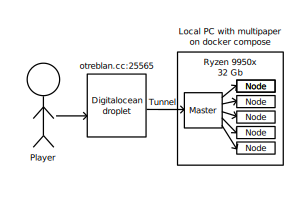

# Servidor de Minecraft

https://docs.google.com/presentation/d/1AUHCdu_ejEFxkMgxHfDEWiIN_HN1UgphUQEWcByiKjE/edit?usp=sharing


## Instrucciones
1) Inicia el servidor de minecraft
``` bash
git clone https://github.com/otreblan/cloud
cd multipaper
docker compose up
```
2) Crea una cuenta en Cloudflare. Compra un dominio y crea un tunnel que redireccione al host del anterior paso en el puerto 25565.
3) Descarga `cloudflared` en el host del servidor y logeate.
4) Crea una cuenta en Digitalocean e inicializa un droplet. Dentro de este copia la carpeta `~/.cloudflared` y redirecciona el puerto 25565 hacia el servidor de Minecraft a travez del tunnel.
5) Configura el dns para que el dominio apunte hacia el ip del droplet.

## Costos
- Dominio (otreblan.cc): 8\$/año
- VPS droplet: 6\$/mes

## Arquitectura


## Video
https://youtu.be/2C55SBClx9w

## Conclusión
El tráfico de red causado por cientos de bots satura la conexión del Droplet.
